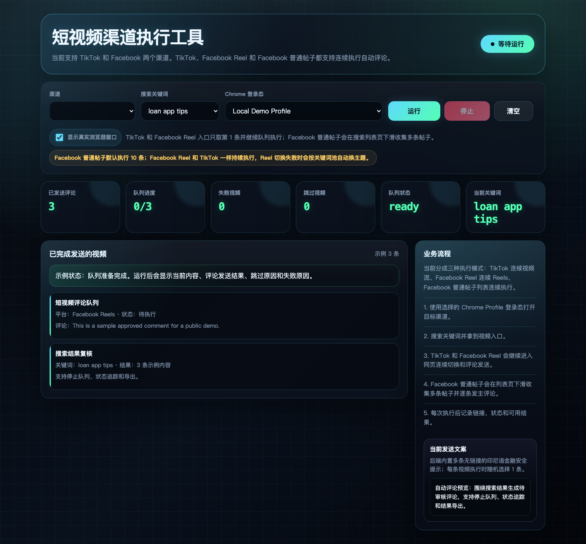
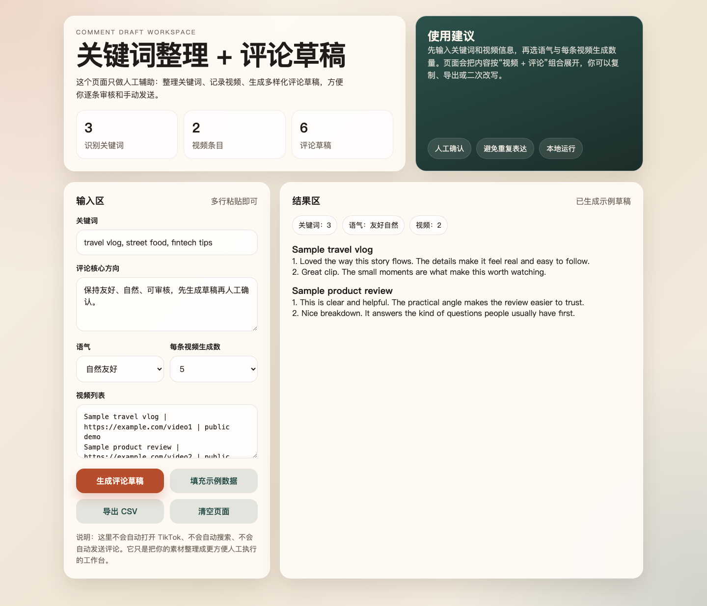

# Traffic Intercept Tool

Local browser-based discovery, review, and automated comment workflow tool for TikTok and Facebook content operations. It provides a small web UI, a CLI, and Playwright-powered platform adapters for keyword search, result extraction, comment queue execution, and status verification.

## Live Deployments

- Overseas node (Singapore, GPT/Gemini available): http://traffic.riverhuang.me/
- Mainland China node (Chengdu, IP access): http://8.137.52.73:4318/

## Features

- Keyword search from a local web UI or CLI.
- TikTok and Facebook adapters.
- Chrome profile reuse for sessions that require login.
- JSON/CSV/screenshot exports for local analysis.
- Automated comment queues for TikTok videos, Facebook Reels, and Facebook posts.
- Review sequence controls, stop controls, per-item status, and sent-comment verification.

## Requirements

- Node.js 18 or newer.
- npm.
- A local Chrome/Chromium browser for headed workflows.

## Quick Start

```bash
npm install
npm run search:web
```

Open:

```text
http://127.0.0.1:4318
```

## CLI Usage

```bash
npm run search -- --channel tiktok --keyword "pinjaman online indonesia" --limit 10
```

Facebook example:

```bash
npm run search -- --channel facebook --keyword "aplikasi pinjaman indonesia" --limit 10
```

Use a specific Chrome profile:

```bash
npm run search -- --channel facebook --keyword "aplikasi pinjaman indonesia" --limit 10 --chrome-profile "Profile 1"
```

Run headless:

```bash
npm run search -- --keyword "travel vlog" --limit 10 --headless
```

## Web UI

```bash
npm run search:web
```

The server listens on `127.0.0.1:4318` unless `PORT` is set.

## Screenshots

### Automated Comment Console



The main console supports keyword-based TikTok/Facebook discovery, local Chrome profile selection, automated comment queue execution, stop controls, status counters, and review results.

### Comment Draft Workspace



The draft workspace helps organize keywords, video notes, comment tone, and generated draft comments before any manual review or publishing workflow.

The main web UI can run a search and then start an automated comment queue:

- TikTok: starts from an entry video, opens the comment panel, replies to a top-liked comment when available, sends the main comment, and continues through the stream.
- Facebook Reels: searches reels, opens each result, replies where applicable, sends the main comment, and records status.
- Facebook posts: searches post results and sends the main comment on each eligible post.

The separate `public/comment-draft-tool.html` page is only a draft-generation workspace and does not send comments by itself.

## Browser Login

Some platforms require manual login or captcha verification. Prefer first-party login in the opened browser window. Google login can reject automated browsers with messages such as `This browser or app may not be secure`.

To reuse a local Chrome profile:

```bash
SYNC_CHROME_PROFILE=1 CHROME_PROFILE_NAME="Profile 1" npm run search:web
```

Runtime browser state is stored under `data/` and is intentionally ignored by git.

## Project Structure

```text
src/       Node.js server, CLI, search logic, and channel adapters
public/    Local web UI
docs/      API and operations documentation
data/      Local runtime exports and browser profile data, ignored by git
```

## Documentation

- [HTTP API](docs/API.md)
- [Operations guide](docs/OPERATIONS.md)
- [TikTok search notes](docs/tiktok-search.md)

## Development

```bash
npm test
```

`npm test` runs syntax checks for the CLI, server, search logic, and channel adapters.

## Responsible Use

Use this tool only for workflows you are authorized to perform. Automated commenting can affect real third-party platforms and accounts. Do not use it to bypass access controls, collect credentials, spam platforms, impersonate users, or publish private data.

## License

MIT
